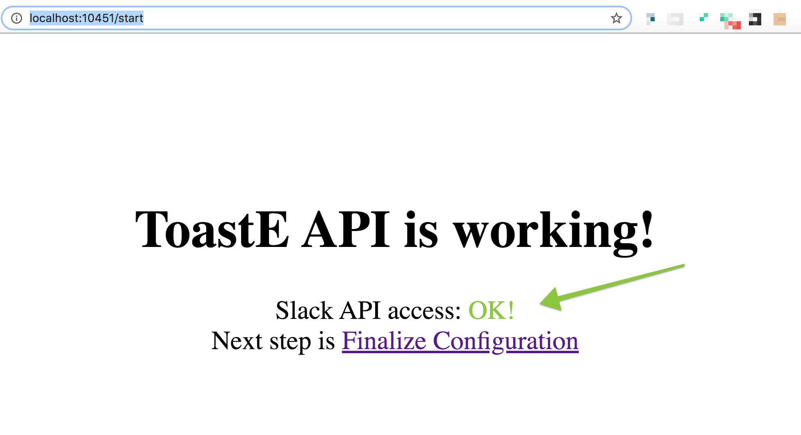

# Setup Verification

### 1. Go to `{API_URL}` in your browser

Which could look like: `http://192.0.0.168:10451`

💡  Note: If you configured a different port during [Host Setup](https://toast-enterprise.gitbook.io/toaste/enterprise/host), you will use that port here instead.

You should see something like:

### 2. Troubleshooting

If the page shows Slack API error, then your host may not be connected to the internet \(it needs to be able to access [https://api.slack.com/](https://api.slack.com/)\). If that is not the case, then it's likely an issue with the Slack ENV variables setup. If you can't figure it out – reach out to [toast@support.com](mailto:toast@support.com) and we will help! 

